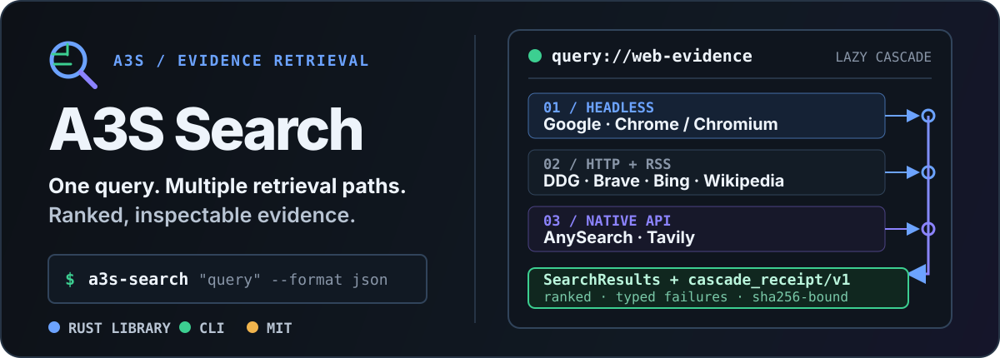

<p align="center">
  
</p>

<p align="center">
  <strong>Extensible web search for Rust, agents, and the command line.</strong>
</p>

<p align="center">
  <a href="https://github.com/A3S-Lab/Search/actions/workflows/ci.yml"></a>
  <a href="https://crates.io/crates/a3s-search"></a>
  <a href="https://docs.rs/a3s-search"></a>
  <a href="https://www.rust-lang.org/"></a>
  <a href="./LICENSE"></a>
</p>

<p align="center">
  <a href="#run-one-search">Quick start</a> ·
  <a href="#why-a3s-search">Why</a> ·
  <a href="#how-the-cascade-works">Architecture</a> ·
  <a href="#retrieval-sources">Sources</a> ·
  <a href="#use-the-rust-library">Rust API</a> ·
  <a href="#configure-with-acl">Configuration</a> ·
  <a href="#reliability-boundaries">Reliability</a> ·
  <a href="#development">Development</a>
</p>

---

A3S Search is a Rust library and CLI for combining browser-rendered search,
conventional HTTP/RSS engines, and native search APIs. It executes independent
sources concurrently, keeps partial failures visible, merges duplicate URLs,
and returns ranked evidence with a verifiable account of the fallback path.

It is a retrieval component, not a research agent. Query decomposition,
iterative investigation, source interpretation, and report writing belong to
the caller.

## Run one search

Install the latest published CLI:

```bash
cargo install a3s-search

# macOS or Linux through the A3S Homebrew tap
brew install A3S-Lab/tap/a3s-search
```

To evaluate the unreleased behavior on `main`, install directly from the
repository instead:

```bash
cargo install --git https://github.com/A3S-Lab/Search --locked
```

Then run the default quality-gated cascade:

```bash
a3s-search "Rust async runtime guidance" --format json --limit 10
```

On current `main`, the JSON result keeps both useful evidence and
degraded-path diagnostics:

| Output | What it preserves |
| --- | --- |
| `results` | Ranked and deduplicated URLs, snippets, provenance, scores, dates, and optional full text |
| `answers` / `images` | Provider-native direct answers and query-level images |
| `reports` | Request IDs, provider timing, total matches, usage, and bounded metadata |
| `failures` | Typed error kind, transient state, provider identity, and optional retry delay |
| `outcomes` | Success, empty, failure, timeout, local rejection, or circuit-open state for every selected engine |
| `cascade_receipt` | Configured tiers, executed prefix, final quality, and whether the plan was exhausted below the floor |
| `cascade_receipt_binding` | Domain-separated SHA-256 identity for the complete receipt |

Inspect available engines and native-provider readiness:

```bash
a3s-search engines
```

Use an exact source set when the task requires it:

```bash
a3s-search "Rust async runtime guidance" \
  --engines ddg,wiki,anysearch,tavily \
  --language en-US \
  --time-range month \
  --format json
```

An explicit `--engines` list is never expanded. `--limit` controls displayed
results; provider-side result limits belong in ACL.

> [!NOTE]
> `main` currently declares version `2.2.0`. The latest crates.io release may
> be older because stable publication remains fail-closed while
> [Search issue #8](https://github.com/A3S-Lab/Search/issues/8) is open.

## Why A3S Search

| Need | Mechanism |
| --- | --- |
| More than one fragile endpoint | Browser, HTTP/RSS, and API transports behind one `Engine` contract |
| Bounded fallback cost | A shared deadline and a quality decision after every lazily executed tier |
| Results that remain explainable | Per-engine provenance, normalized rank signals, typed failures, and request reports |
| Independent evidence without duplicate noise | Canonical URL merging and weighted reciprocal-rank fusion |
| Safe integration into long-lived agents | Shared circuits, bulkheads, retry budgets, and in-flight request coalescing |
| Provider extensibility | A provider-neutral `SearchProvider` protocol adapted through `ProviderEngine` |
| Configuration without secret leakage | Typed ACL and redacted environment credential sources |

The runtime ranker contains no query-topic, host, publisher, named-entity, or
language exceptions. Domain-specific research policy stays above the search
kernel.

## How the cascade works

Without an explicit source list or ACL source selection, the CLI uses this
browser-first plan:

```text
SearchQuery
    │
    ├─ 01  headless      Google through Chrome/Chromium
    │       └─ quality met? stop
    │
    ├─ 02  HTTP / RSS    DuckDuckGo + Brave + Bing + Wikipedia
    │       └─ quality met? stop
    │
    └─ 03  native API    AnySearch + Tavily
            └─ finish with results + cascade receipt
```

The important boundaries are:

1. The first headless attempt is capped at five seconds.
2. All tiers share one end-to-end deadline, 20 seconds by default.
3. Engines inside one tier run concurrently with isolated timeouts.
4. One source failure never discards successful results from another source.
5. A tier is skipped once the combined result set satisfies the generic
   quality floor.
6. Explicit CLI sources are exact. Enabled ACL sources replace the built-in
   plan when source blocks are present.

Build with `--no-default-features` when the host must not compile or run a
browser. The built-in plan then starts with HTTP/RSS and can continue to native
APIs.

The library does not impose the CLI order. Callers can compose
`SearchCascade`, name their own tiers, set their own quality floor, and create
expensive browser resources only inside `run_tier_if_needed`.

### Core layers

```text
AnySearch ─┐
Tavily ────┼─ SearchProvider ─ ProviderEngine ─┐
Custom ────┘                                  │
                                              ├─ Search
HTTP / RSS engines ───────── Engine ──────────┤
Browser engines ─ PageFetcher ─ Engine ───────┘
                                                 │
                          Aggregator ─ SearchQuality ─ SearchResults
                                                 │
                                  SearchCascadeReceiptV1
```

- `SearchProvider` models typed API capabilities, requests, readiness, rich
  responses, and sanitized provider failures.
- `ProviderEngine` adapts a provider into the stable engine contract and
  applies provider-neutral output normalization.
- `Search` owns parallel execution, timeouts, optional shared controls, typed
  outcomes, and partial failures.
- `Aggregator` owns URL normalization, evidence merging, provenance, and rank
  fusion.
- `SearchCascade` owns generic quality decisions and a caller-declared lazy
  tier plan.

See the complete public surface on [docs.rs](https://docs.rs/a3s-search).

## Retrieval sources

### Native providers

| Provider | Protocol | Credential-free mode | Rich evidence |
| --- | --- | --- | --- |
| [AnySearch](https://www.anysearch.com/) | MCP over JSON-RPC 2.0 | Anonymous | Full text, total count, timing, request ID |
| [Tavily](https://www.tavily.com/) | Tavily Search REST API | Keyless header | Answers, relevance, raw content, images, favicon, usage, metadata |

Both providers accept optional bearer authentication:

```bash
export ANYSEARCH_API_KEY="..."
export TAVILY_API_KEY="..."
export TAVILY_PROJECT="..." # authenticated Tavily requests only
```

Prefer `env("VARIABLE")` in ACL. Credentials are never written by the provider
adapters, included in endpoint URLs, or retained from provider response bodies.

<details>
<summary><strong>AnySearch protocol and vertical routing</strong></summary>

The built-in adapter sends the AnySearch `search` tool through MCP
`tools/call` to `POST https://api.anysearch.com/mcp`. It follows the
[AnySearch Skill v2.1.0](https://github.com/anysearch-ai/anysearch-skill/tree/v2.1.0)
contract and does not mix in AnySearch's separate `/v1/search` REST schema.

The one-query provider contract implements the Skill's `search` operation.
Workflow operations such as `get_sub_domains`, `batch_search`, and `extract`
remain in the official AnySearch Skill. Obtain a documented sub-domain and its
required parameters before configuring vertical routing.

Supported top-level routing domains are:

```text
general, resource, social_media, finance, academic, legal, health,
business, security, ip, code, energy, environment, agriculture,
travel, film, gaming
```

Use `{domain}.{sub_domain}` and keep the sub-domain prefix equal to `domain`.

</details>

<details>
<summary><strong>Tavily controls</strong></summary>

The typed Tavily adapter supports search depth, topic, direct answers, raw
content, domain filters, date bounds, country boost, automatic parameters,
exact matching, images, image descriptions, favicons, usage, and safe search.

`chunks_per_source` requires advanced depth.
`include_image_descriptions` requires images.
Country boost applies only to the general topic. Tavily follows the documented
`include_usage = false` default; enable it explicitly when credit evidence is
required.

With `auto_parameters = true`, omit depth and topic when Tavily should select
them. Explicit compatible values intentionally pin those fields.

</details>

### Conventional engines

| Shortcut | Source | Transport | Built-in default |
| --- | --- | --- | --- |
| `g` | Google | A3S Browser | Yes |
| `ddg` | DuckDuckGo | HTTP | Yes |
| `brave` | Brave Search | HTTP | Yes |
| `bing` | Bing International | RSS | Yes |
| `wiki` | Wikipedia | MediaWiki JSON API | Yes |
| `baidu` | Baidu | A3S Browser | Explicit |
| `sogou` | Sogou | HTTP | Explicit |
| `360` | 360 Search | HTTP | Explicit |
| `bing_cn` | Bing China | RSS | Explicit |

HTML engines validate the response structure before parsing. CAPTCHA,
verification, consent, and anti-bot pages become typed transient `challenge`
failures. An unrelated successful HTTP page becomes `invalid_response` rather
than a false empty result.

## Ranking and quality evidence

The aggregator first deduplicates each engine response, then merges results by
normalized URL across engines. It removes common tracking parameters and
combines independent provenance, positions, rich fields, and rank signals.

Each engine contributes through weighted reciprocal-rank fusion:

```text
engine weight
× reciprocal rank
× bounded query-alignment factor
× provider-local relevance factor
```

Provider relevance values are calibrated only within that provider response;
incomparable API score scales are never multiplied directly across sources.
Query alignment uses visible title and snippet text plus a weak URL signal.
Unicode units and character n-grams keep the mechanism language-neutral without
embedding topic-specific rules.

For a display limit of ten, the default floor evaluates the leading evidence
window against these generic signals:

| Signal | Default expectation |
| --- | --- |
| Usable HTTP(S) results | Up to five |
| Distinct normalized hosts | Up to three |
| Contributing engines | At least one |
| Per-result query match | At least `0.35` for half the target |
| Mean query match | At least `0.30` |
| Cross-engine consensus | Observable, not required by default |

Research callers can require stronger consensus or a different floor. The
built-in floor deliberately does not claim to measure publisher authority,
factual correctness, recency, viewpoint coverage, or completeness.

If every declared tier runs below the floor, the CLI returns the remaining
evidence with `quality_floor_met = false` and
`exhausted_below_floor = true`. Downstream products can fail closed on that
state.

### Verifiable cascade receipts

`finish_with_tier_plan` returns the final `SearchResults` with a versioned
receipt that binds:

- the complete typed query;
- the configured tier plan and executed prefix;
- every tier quality decision;
- the ordered final results and rich evidence fields;
- failures, reports, outcomes, counts, and timing metadata.

`receipt_binding()` calculates a domain-separated canonical SHA-256 over the
complete validated receipt. It detects substitution when compared with a
trusted expected digest. Structural validity and a digest do not prove who ran
the search or that the plan was committed before execution; authenticity still
requires a trusted signature, digest log, or equivalent authority.

## Use the Rust library

Add the current major release:

```toml
[dependencies]
a3s-search = "2"
tokio = { version = "1", features = ["full"] }
```

Run multiple engines under one orchestration contract:

```rust
use a3s_search::{
    engines::{DuckDuckGo, Wikipedia},
    Search, SearchQuery,
};

#[tokio::main]
async fn main() -> a3s_search::Result<()> {
    let mut search = Search::new();
    search.add_engine(DuckDuckGo::new());
    search.add_engine(Wikipedia::new());

    let results = search
        .search(SearchQuery::new("extensible Rust search"))
        .await?;

    for result in results.items() {
        println!(
            "{:.3} {} {:?}",
            result.score,
            result.url,
            result.engines
        );
    }
    Ok(())
}
```

Provider APIs use the same `Search` orchestration:

```rust
use a3s_search::providers::BuiltinProvider;
use a3s_search::{Search, SearchQuery};

#[tokio::main]
async fn main() -> a3s_search::Result<()> {
    let mut search = Search::new();
    search.add_engine(BuiltinProvider::AnySearch.create_engine()?);
    search.add_engine(BuiltinProvider::Tavily.create_engine()?);

    let results = search
        .search(SearchQuery::new("current Rust async guidance"))
        .await?;
    println!("{} aggregated results", results.count);
    Ok(())
}
```

### Add a provider

Implement the provider-neutral protocol and wrap it in `ProviderEngine`:

```rust
#[async_trait]
pub trait SearchProvider: Send + Sync {
    fn descriptor(&self) -> ProviderDescriptor;
    fn readiness(&self) -> ProviderReadiness;
    async fn search(
        &self,
        request: &ProviderRequest,
    ) -> Result<ProviderResponse>;
}

let engine = ProviderEngine::new(my_provider);
search.add_engine(engine);
```

The adapter preserves direct answers, suggestions, full text, images,
relevance, usage, and request reports without encoding them as synthetic web
results. Provider output crosses a bounded normalization boundary before it
reaches callers.

## Configure with ACL

Use the A3S Agent Configuration Language for source selection, credentials,
timeouts, ranking, and provider-specific controls:

```acl
timeout {
  value = 20
}

ranking {
  rrf_rank_constant       = 60
  query_alignment_weight  = 0.8
  native_relevance_weight = 0.2
}

engine "g" {
  enabled = true
  weight = 1.2
  timeout = 8
}

provider "anysearch" {
  enabled = true
  api_key = env("ANYSEARCH_API_KEY")
  max_results = 10
}

provider "tavily" {
  enabled = true
  api_key = env("TAVILY_API_KEY")
  project = env("TAVILY_PROJECT")
  search_depth = "advanced"
  chunks_per_source = 3
  max_results = 10
  include_answer = "advanced"
  include_raw_content = "markdown"
  include_images = true
  include_favicon = true
}
```

Run with the configuration:

```bash
a3s-search --config search.acl engines
a3s-search "query" --config search.acl --format json
```

Configuration is type-checked:

- provider endpoints require HTTPS, except loopback HTTP used by tests;
- integral values are range-checked without silent saturation;
- weights, timeouts, date ranges, domains, and cross-field requirements are
  validated;
- duplicate source blocks and a source configured as both engine and provider
  are rejected;
- `api_key = null` explicitly forces AnySearch anonymous or Tavily keyless
  mode;
- credential debug output is redacted.

See [`SearchConfig`](https://docs.rs/a3s-search/latest/a3s_search/struct.SearchConfig.html),
[`AnySearchConfig`](https://docs.rs/a3s-search/latest/a3s_search/providers/struct.AnySearchConfig.html),
and [`TavilyConfig`](https://docs.rs/a3s-search/latest/a3s_search/providers/struct.TavilyConfig.html)
for the complete typed surface.

## Reliability boundaries

The library exposes composable controls instead of hiding policy in global
state:

| Control | Boundary |
| --- | --- |
| `HealthMonitor` | Compatibility per-`Search` consecutive-failure suspension |
| `CircuitBreaker` | Shared closed/open/half-open engine state with failure, empty, slow-call, and `Retry-After` policies |
| `Bulkhead` | Bounded per-engine in-flight work and queue wait |
| `RetryBudget` | Token bucket that limits retry amplification |
| `SearchCoalescer` | Bounded, cancellation-safe sharing of identical overlapping requests |
| `Metrics` | In-memory success/failure counters and p50/p95/p99 latency |

Share compatible controls across long-lived `Search` instances:

```rust,no_run
use a3s_search::{Bulkhead, CircuitBreaker, Search, SearchCoalescer};

let bulkhead = Bulkhead::default();
let circuit = CircuitBreaker::default();
let coalescer = SearchCoalescer::default();

let search = Search::new()
    .with_bulkhead(bulkhead.clone())
    .with_circuit_breaker(circuit.clone())
    .with_request_coalescer(coalescer.clone());
```

Scope shared state to compatible tenants, credentials, endpoints, proxies,
safe-search settings, freshness requirements, and ranking policy. The
coalescer retains only in-flight work; it is not a result cache.

The standalone CLI constructs its controls inside one command invocation.
Applications that need circuit history across requests should own and reuse
the library controls in a long-lived runtime.

### Browser rendering

The default `headless` Cargo feature uses the typed renderer from
[A3S Browser](https://github.com/A3S-Lab/Browser):

| Feature | Behavior |
| --- | --- |
| `headless` (default) | Discover installed or previously managed Chrome/Chromium |
| `lightpanda` | Add Lightpanda as an explicit backend; never selected implicitly |
| no default features | Remove the browser/CDP dependency stack |

Chrome/Chromium is the native Windows backend. Lightpanda requires WSL2 on a
Windows host.

Browser owns discovery, process lifecycle, rendering, tab limits, and cleanup.
Search owns search URLs, wait conditions, HTML validation, retries, and
search-specific metrics. `BrowserFetcher` applies one total deadline across
rendering, queueing, backoff, and bounded retries.

Request Lightpanda only in a build that enables it:

```bash
cargo run --features lightpanda -- "query" --browser lightpanda
```

### Full text, proxies, and metrics

Native providers may return `full_text` directly. Snippet-only results can be
enriched through the same `PageFetcher` abstraction:

```rust
use a3s_search::{
    enrich_full_text, HttpFetcher, PageFetcher, SearchResults,
};
use std::sync::Arc;
use std::time::Duration;

async fn enrich(results: &mut SearchResults) {
    let fetcher: Arc<dyn PageFetcher> = Arc::new(HttpFetcher::new());
    enrich_full_text(results, fetcher, 8, Duration::from_secs(10)).await;
}
```

Failed enrichment keeps the original snippet.

Conventional engines support a static proxy or a rotating `ProxyPool`.
Provider APIs own separate bounded HTTP clients and intentionally do not
inherit scraping proxies. The CLI never echoes a potentially
credential-bearing proxy URL.

Attach one `Metrics` registry to `Search`, `HttpFetcher`, or `BrowserFetcher`
when the host needs request counts, failure classes, and latency percentiles.

## Development

Run checks from the Search repository, not from the A3S monorepo root:

```bash
cargo fmt --all -- --check
cargo test --no-default-features --locked
cargo test --all-features --locked
cargo clippy --all-targets --no-default-features --locked -- -D warnings
cargo clippy --all-targets --all-features --locked -- -D warnings
RUSTDOCFLAGS="-D warnings" cargo doc --no-deps --all-features --locked
cargo package --locked
scripts/test-release-package.sh
scripts/test-freeze-crate.sh
```

The test strategy separates deterministic correctness from live availability:

- loopback provider-contract tests verify protocols, authentication,
  normalization, and sanitized failures;
- the checked-in quality corpus verifies ranking and generalization invariants;
- deterministic fault injection exercises throttle, empty response, recovery,
  cancellation, concurrency, and resource drainage;
- a bounded one-pass live canary evaluates a sealed corpus without requiring a
  24-hour soak.

Run the reproducible ranking gate:

```bash
cargo test --locked --test quality_eval
```

Run the opt-in bounded reliability soak:

```bash
A3S_SEARCH_SOAK_SECONDS=300 \
  cargo test --release --test soak deterministic_reliability_soak \
  -- --ignored --nocapture --exact
```

Release jobs package and freeze the exact `.crate` bytes in an unprivileged
job before any publication step. Release authorization remains separate from
retrieval quality and is intentionally fail-closed while
[issue #8](https://github.com/A3S-Lab/Search/issues/8) remains unresolved.

## Bundled agent Skill

Every platform release archive includes:

```text
a3s-search
skills/a3s-search/SKILL.md
skills/a3s-search/agents/openai.yaml
```

The Skill guides coding agents through source selection, structured evidence,
credential handling, ACL, quality receipts, and partial failures.

## A3S ecosystem

A3S Search is independently usable and also serves higher-level A3S products:

- [A3S](https://github.com/A3S-Lab/a3s) — unified platform and component entry point
- [A3S Code](https://github.com/A3S-Lab/Code) — governed coding-agent runtime
- [A3S Browser](https://github.com/A3S-Lab/Browser) — typed browser rendering boundary

## Contributing

Issues and focused pull requests are welcome. Keep runtime ranking and quality
rules domain-neutral, add regression coverage for changed behavior, and run
the relevant no-default and all-feature checks before submitting.

## License

[MIT](./LICENSE)
